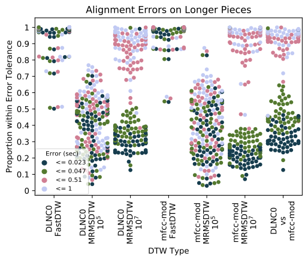

# Parallelizable Dynamic Time Warping with Linear Memory

This repository contains an implementation of the linear memory, parallelizable algorithm for Dynamic Time Warping (DTW) described in [1], which we refer to as ``linmdtw'' for short.  This algorithm can be used to align multivarite time series that are re-parameterized version of each other, such as audio of different orchestral performances.  Please refer to the notebooks for examples.

This repository also contains efficient cython implementations of FastDTW [2] and Memory-Restricted Multiscale DTW (MrMsDtw).  Please refer to the examples for usage.

For simplicity of implementation, we have restricted our focus to multivariate time series in Euclidean spaces, but pull requests are welcome!  

## Installation 

To get started, simply type
~~~~~ bash
pip install linmdtw
~~~~~

Alternatively, you can checkout this repository and run
~~~~~ bash
pip install -r requirements.txt
python setup.py install
~~~~~

### Audio Utilities

By default, it only install requirements needed to align general Euclidean time series.  To use the audio features and audio stretching utilities, you must also install the audio requirements
~~~~~ bash
git clone https://github.com/ctralie/linmdtw.git
cd linmdtw
pip install -r requirements.txt
python setup.py install
~~~~~

### GPU Acceleration

This library falls back to a CPU implementation when a GPU is not available, but it is not recommended.  If you have a CUDA-capable GPU on your computer, you should install an appropriate version of pycuda by running

~~~~~ bash
pip install -r requirements_gpu.txt
~~~~~

### Notebooks

Once you've finished the installation, check out the notebooks/ directory for example usage!

## Experiments

To replicate our experiments in [1], first install youtube-dl

~~~~~ bash
pip install youtube-dl
~~~~~

This is used to download the audio examples from Youtube (50 "short" pairs and 50 "long" pairs).  Then, go into the <code>experiments/</code> directory and type

~~~~~ bash
python orchestral.py
~~~~~

This file will download as many of the URLs as are still available, and it will compare the exact alignment to FastDTW and MrMSDTW using different features.  It is highly recommended that GPU acceleration is in place before running these experiments.  Even then, they make take up to 24 hours on a personal computer.

After all of the experiments have finished, you can generate figures by running

~~~~~ bash
python paperfigures.py
~~~~~

One of the figures that depicts alignment discrepancies on longer pieces is shown below.  There are four different color dots per pair of pieces that indicate the proportion of correspondences between each piece that fall below the alignment discrepancies (23 ms, 47 ms, 510ms, and 1 second)

In each figure for each pairwise comparison,

## How To Cite

If you use this software package in any of your work, please cite

~~~~~ bash
@inproceedings{tralie2020linmdtw,
  title={Parallelizable Dynamic Time Warping Alignment withLinear Memory},
  author={Tralie, Christopher and Dempsey, Elizabeth},
  booktitle={Proc. of the Int. Soc. for Music Information Retrieval Conf. (ISMIR), in print},
  year={2020}
}
~~~~~

## References

[1] ``<a href = "http://www.ctralie.com/Research/linmdtw/paper.pdf">Exact, Parallelizable Dynamic Time Warping Alignment with Linear Memory</a>'' by <a href = "http://www.ctralie.com">Christopher Tralie</a> and Elizabeth Dempsey.

[2] Stan Salvador and Phillip Chan. Fastdtw: Toward accurate dynamic time warping in linear time andspace.Proc. of ACM Knowledge Data And Discovery (KDD), 3rd Wkshp. on Mining Temporal andSequential Data, 2004.

[3] Thomas Prätzlich, Jonathan Driedger, and Meinard Müller. Memory-restricted multiscale dynamic timewarping. InProc. of the IEEE Int. Conf. on Acoustics, Speech and Signal Processing (ICASSP), pages569–573. IEEE, 2016.